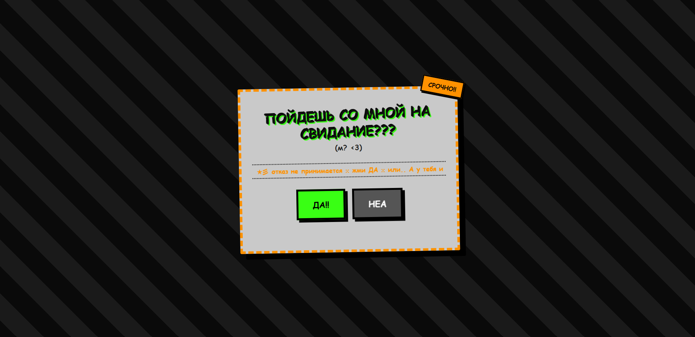

# Свидание это не вопрос 🔥

Рофляная одностраничная приглашалка на свидание. Кнопка "неа" убегает по экрану,
уменьшается и в итоге сдаётся, превращаясь в кнопку "ДА".

## Структура проекта

```
date-invite/
├── index.html   — разметка страницы
├── style.css    — все стили и анимации
├── script.js    — логика убегающей кнопки, конфетти, показ результата
└── README.md    — этот файл
```

## Превью

<p align="center">
  
</p>

## Как настроить под себя

- Текст заголовка и подписи — в `index.html`, внутри `<h1>` и `.subtitle`
- Сколько раз кнопка "неа" убегает, прежде чем сдаться — переменная
  `maxDodges` в начале `script.js` (сейчас 6)
- Фразы, которые показываются под кнопками при промахах — массив `phrases`
  в `script.js`
- Финальные тексты после нажатия — в функции `showResult()` в `script.js`
- Цвета — в начале `style.css` (`#39ff14` зелёный, `#ff9100` оранжевый,
  `#555` серый — меняй под свою палитру)
